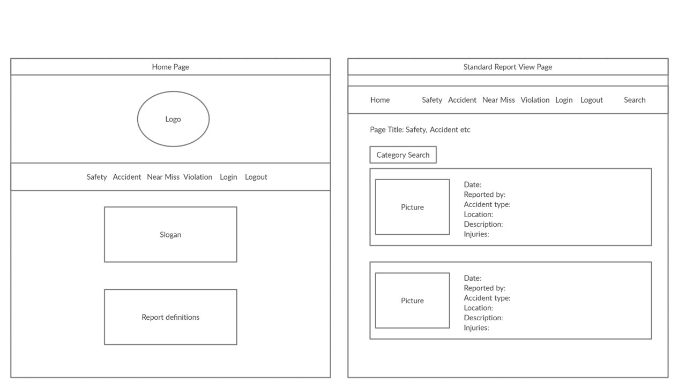
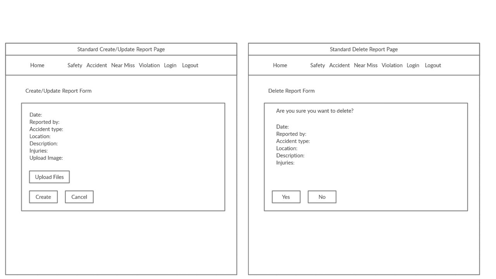
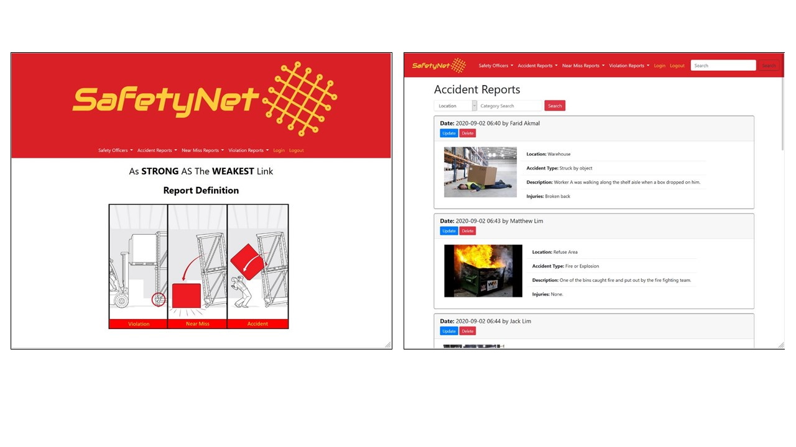
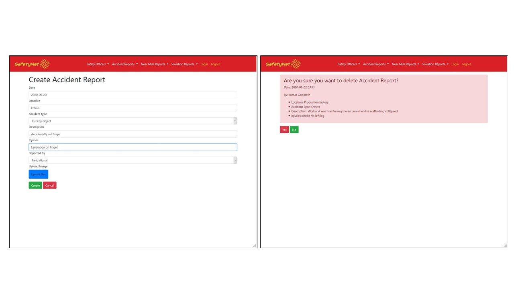
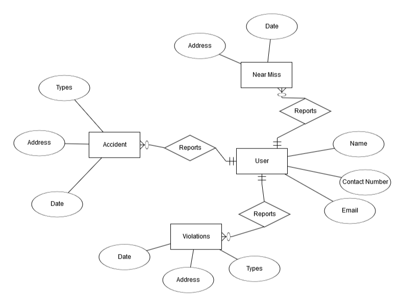
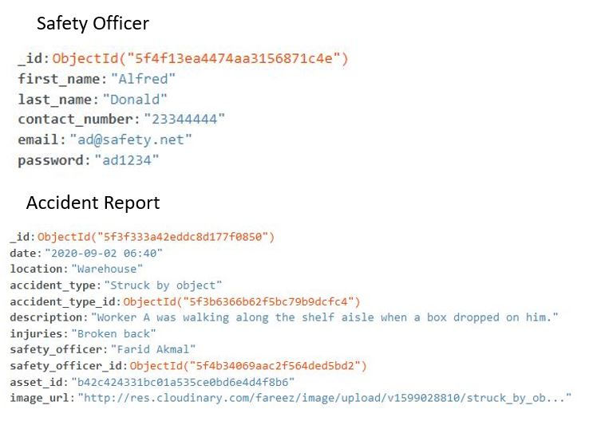

# SafetyNet

## Project 3: Python and Data Centric Development

### Context
In the all industries, safety is paramount in making sure that the employees can work with a peace of mind and operations can run smoothly. This is especially crucial in heavy industries where the nature of the jobs are dangerous and no safety plan can completely eliminates all risk. Hence, having a strong reporting culture will educate and inform employees to do their work in a safe manner. 

This reports are meant for:
- Accident, defined as unexpected and undesirable event, especially one resulting in damage or harm. 
- Near miss, defined as an unplanned event that has the potential to cause, but does not actually result in injuryn or damage.
- Violation, defined as an action that breaks or acts against something, especially a law.

However, most reports are done via Microsoft word or excel document and this makes it inefficient to extract and retrieve data.

SafetyNet is meant for employees working in a company to upload safety reports that they see in their workplace. With SafetyNet, these reports can be directly be uploaded direct to the company database. All personnel can read the reports on the various safety issues and but only those registered can edit or delete their reports. This will empower employees to take action in reporting and be responisble for their own safety.

Website can be accessed via this link: https://fa-safetynet.herokuapp.com

Demo account:

Login: demo@safety.net

Password: demo12

## UI/UX

### Strategy
User Stories:

- As an Employee, I would like to be able to view reports on any safety violations in my company so as not to make the same mistake.

- As an Employee, I would like to complete the safety reports quickly with adequate information without having to go through a lengthy form.

- As a Safety officer, I would like to get a concise safety report so that I can quickly understand the situation and react swiftly.

- As a Safety officer, I would like to have direct updates on safety reports to be able to correct or help the situation.

### Features
#### Flask Login
With FLask Login, users have to sign up and login to their accounts to be able to create, update or delete reports. If the users are not login, they would still be able to view the reports. However, buttons allowing the user to create, update and delete will not be shown. There will be validations for the login which requires it to be in an email format as well as the password have to be 6 characters long.

#### Form Validation
All forms will have validations to ensure that respective information is collected. This is to ensure that the necessary information required is sufficient to provide a complete picture of the safety situation at the time of report. The date is set to .now() to prevent any gaming of the reports as the safety report has to be completed as soon as possible.

#### Picture Upload
A picture tells a thousand words and having one in the report will give the user a better grasp of the situation. Therefore, users are able to upload pictures on the create and update forms but it is not a compulsory requirement as in the heat of an emergency it may not be ideal to take a photo before saving oneself.

#### Search Functions
For safety officers, there is only 1 search fucntion which is by their name. For the safety reports, there will be 2 types of search functions. The global search which is located at the navbar allows the user to search any content within the respective reports. The category search allows the user to narrow down their search to location, accident type, violation type or injury.

### Features Left to Implement
- User profile
- Administrator account
- Pagination
- Password verification
- Statistics of reports by accident types, violation types

### Structure

The website follows a hierachy structure that allows for horizontal page routing. In this way, the user can always move quickly the page they want even if it takes thme 3 clicks to get to the end of the page. 

### Wireframe

The idea of the design is to allow quick routing from 1 page to another and that is why the navbar is available throughout the pages. The read page allows the user to scroll down and through all the reports. The forms are to have a clean look so as to be straight forward and reduce time to fill it. The delete page is meant to be upfront so that the user is aware of the action that the user is doing.

### Completed Website

The color scheme is in red and yellow to highlight danger. The home page shows the definition of the reports in picture so as to make it easier for the user to decide what is the report that the user wants to write. The show all page allows the user to see the reports in a card format with the highlight on when and who made the report.

The forms of the website are clean and minimalist design to evoke a simple and clear feeling in the user. This way, the reports can be concise and to the point. As for the delete form, it is all in red to highlight the danger of deleting a report.

## Technologies Used
1. HTML
2. CSS
3. Javascript
4. Python
5. Bootstrap - For form and card styling
6. MongoDB - For storing data on database
7. Flask - For creation of the project
8. Flask Login - For authentication
9. Pymongo - For communication between Python and MongoDB
10. Toastr - For flash messaging

## Programming Methodologies
1. .env file - For storing security features such as Secret Key and MongoURI
2. Gitpod and Github - For source control
3. Heroku - For hosting the project

## Database Design

The design is from the user which forms a one to many to all the reports but the relationship is optional. While the reports are in a many to one mandatory relationship with the user.

The safety officer is a strong entity. The accident report uses an embedded document to incorporate the accident types and the safety officer.

## Testing
No automated testing was done.

### Testing procedure
[Testing Procedure](static/safetynet-testing-procedure.pdf)

### Known Bugs
- The search boxes do not retain the characters after the search has been done
- Update function does not retain the values of the original report

### Code validation 
- Code validation fails as there are jinja elements in the HTML
- When using https://validator.w3.org errors will be highlighted that shows the jinja style

## Deployment
This website is deployed on Heroku. The URL for the deployed website is https://fa-safetynet.herokuapp.com/

### To deploy on Heroku

- Download or Clone the master branch from github, https://github.com/Freezefaz/Project-3-Safetynet
- To list all the requirements in requirements.txt, run the following command in terminal:
- pip3 freeze --local > requirements.txt
- Set Debug to False
- Procfile need to be created to run gunicorn upon deployment
- Git push to Heroku Master after all the documents are properly set up
- All public keys and private keys for the following need to be added to in Heroku Config Vars settings:
1. MongoDB URI
2. MongoDB Secret Key
3. Dabatase Name : safetynet
4. Cloudinary Upload Preset
5. Cloudinary Cloud Name

## Credits

- Wireframe - https://creately.com
- Free Logo Design - www.freelogodesign.org
- Safety Poster for home page - https://www.taylordesign.com/wp-content/uploads/2017/04/Near_Miss_1.jpg
- Various images from Google Images for database example - https://www.google.com.sg/imghp?hl=en&tab=wi&ogbl
